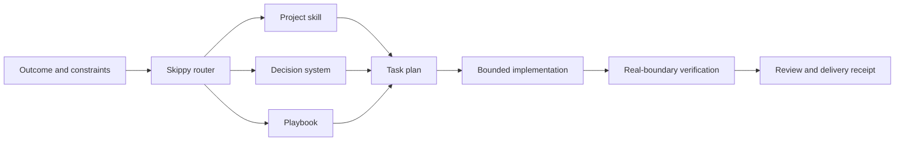
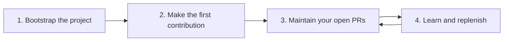
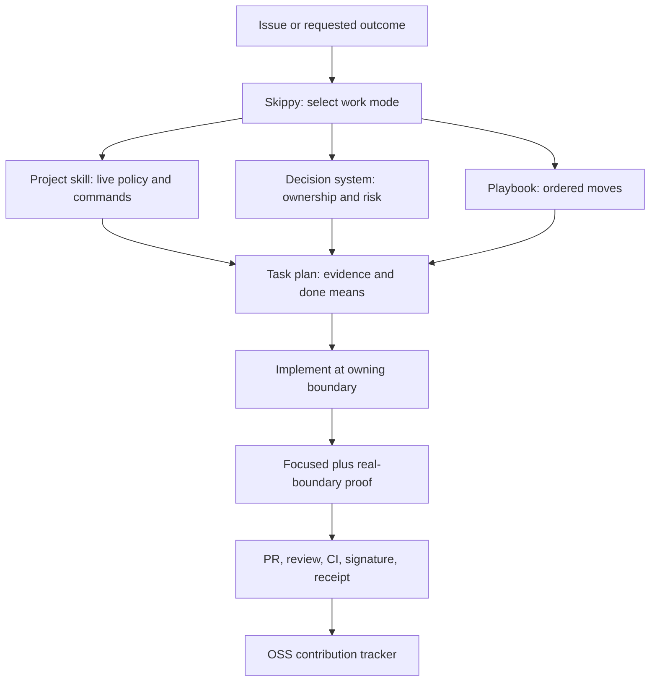
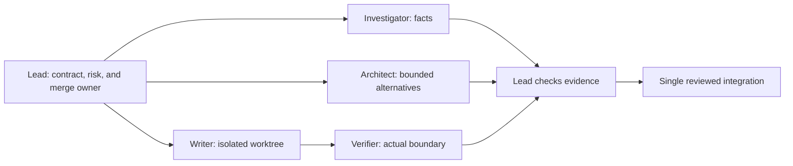

# Skippy

## Rigorous engineering for coding agents

You describe the outcome. Skippy chooses a playbook, creates a task list, loads
the right project skill, coordinates bounded specialist work when it helps, and
demands evidence before it reports success.

Skippy is an engineering system for the gap between code generation and work
another engineer can trust. It is bigger than a collection of prompts and
bigger than a collection of skills: it combines decision rules, playbooks,
project adapters, task artifacts, role boundaries, helper programs, and a
verification gate.



Its standard is simple: write less code, own the right boundary, and prove the
behavior that changed.

## Getting started

Skippy is a set of agent instructions, not a shell command. Add or attach
[Skippy Mode](skippy/SKILL.md) to your coding agent, then attach the relevant
project skill under `projects/`. The examples below are prompts you send to the
agent, not commands to paste into Terminal.

For a new contributor, follow this path:



### 1. Bootstrap a project

If the repository does not already have a Skippy project skill, start here:

```text
skippy bootstrap https://github.com/owner/repository
```

Skippy investigates the repository's architecture, design and coding guidance,
languages and tooling, contribution policy, CI, merged PRs, closed-unmerged
PRs, and current overlap. It creates a provisional project profile under
`projects/<project>/`, then verifies the profile during the first real
contribution. Bootstrap does not modify the upstream project.

For an already-supported project, skip bootstrap and load its existing skill.

#### Example: bootstrap `meridianlabs-ai/ts-mono`

```text
skippy bootstrap https://github.com/meridianlabs-ai/ts-mono
```

Skippy's first pass would record only observed facts: the public repository
describes itself as a TypeScript monorepo and exposes `apps/`, `packages/`,
`tooling/`, `design/`, and `docs/`, alongside `pnpm-workspace.yaml`,
`turbo.json`, `AGENTS.md`, and `CLAUDE.md`. It would then read those sources,
not guess from their names, and produce a provisional `projects/ts-mono/`
profile containing:

- the workspace and package boundaries, runtime/toolchain commands, and test,
  lint, typecheck, build, and release paths;
- repository architecture, dependency direction, design and coding rules, and
  the ownership of shared tooling;
- contribution policy, branch and commit conventions, PR template, CI gates,
  and maintainer expectations;
- a sample of recent merged, open, and closed-unmerged PRs, with lessons about
  validation, review, scope, and changes that did not land; and
- the live issue and PR overlap picture, plus a proposed contribution queue
  target that is confirmed against repository policy before any PR is opened.

That profile is a hypothesis with evidence links, not a claim that Skippy has
already mastered the repository. The first contribution validates and refines
it. See the [ts-mono repository](https://github.com/meridianlabs-ai/ts-mono)
and the [bootstrap playbook](playbooks/bootstrap-project.md).

### 2. Start contributing

If you already know the issue or outcome, name it:

```text
skippy contribute to <project>. Pick a well-scoped issue, screen for overlap,
implement the smallest owning fix, run the project validation, and open the PR.
```

For a specific bug, be explicit about the outcome and preserved behavior:

```text
skippy The OAuth callback occasionally creates duplicate sessions.
Reproduce both deliveries, trace the owning race, fix it, and prove one session
is created. Keep valid login and logout behavior unchanged.
```

If you do **not** know which issue to pick, do not stop at a list of options.
Use the queue workflow instead:

```text
skippy sweep and replenish <project>
```

Skippy first maintains every existing open PR. It then scans and screens issues
for overlap, linked development, maintainable scope, and an executable
validation path. It selects qualified independent issues, carries each through
the full project recipe, and keeps running until the configured healthy queue
target is reached or a concrete policy, environment, or candidate-quality
blocker is recorded. It does not exceed the project maximum or publish without
the authority the project requires.

### 3. Maintain and replenish your contribution queue

Choose the number of healthy open contributions you want. If the project has no
explicit target, Skippy defaults to **5**, unless current repository policy sets
a lower maximum. A project policy always wins over the default.

```bash
./scripts/configure-project-queue.sh nemoclaw 5 10
```

Then tell the agent:

```text
skippy sweep and replenish nemoclaw to 5 open PRs
```

It examines every one of your open PRs first. As PRs merge or close, it learns
from the outcome, screens new issues for overlap, and replenishes only with
fully validated, independently healthy contributions.

### 4. Schedule it

On an agent host with recurring tasks, schedule the
[sweep-and-replenish prompt](automations/continuation/sweep-and-replenish-prompt.md)
at the interval you want, for example every hour. Fill in the project path,
checkout path, queue target, and verified maximum. On agents without a native
scheduler, send the same prompt manually when you want a sweep.

The scheduler continues the same maintenance and replenishment method. It does
not bypass project limits, quality gates, or the authority required to publish a
PR.

## What makes it an engineering system

| Layer | Purpose |
| --- | --- |
| [Skippy Mode](skippy/SKILL.md) | Routes the request, keeps the plan visible, selects supporting capabilities, and enforces the completion gate |
| [Engineering decision system](references/engineering-principles.md) | Guides ownership, complexity, reliability, security, evidence, and delivery decisions without reducing engineering to a count of slogans |
| [Playbook library](playbooks/index.md) | Supplies the ordered work moves for investigation, change, assurance, autonomous work, and contribution queues |
| [Project skills](#project-skills) | Supply each repository's live contribution policy, commands, layout, CI, review, and maintainer conventions |
| [Parallel-work protocol](references/delegation.md) | Defines accountable integration, isolated writers, independent review, and evidence handoffs |
| [Task artifacts and helpers](#durable-work) | Make decisions, completion criteria, and verification replayable across agents and sessions |
| [Contribution tracker](https://github.com/deepujain/oss-contribs) | Shows the cross-project queue without replacing the source repository's authoritative PR state |

The system is intentionally layered. A project skill does not have to recreate
general engineering judgment, and Skippy does not claim to know local facts it
has not read from the project.

The decision system is grounded in a short, explicit
[engineering foundations reading map](references/engineering-foundations.md),
then translated into work moves rather than copied as book summaries.

## Repository map

```text
skippy/
├── skippy/       Router and specialist role definitions
├── references/   Shared contribution protocol, principles, and evidence rules
├── playbooks/    Work sequences selected by uncertainty and risk
├── projects/     One project-specific contribution skill per OSS project
├── scripts/      Task-plan, decision-log, and structural-validation helpers
├── automations/  Optional continuation prompts for supported clients
└── README.md      Start here
```

The top-level folders are intentional: shared engineering guidance is separate
from project adapters, and reusable playbooks are separate from both.

## The five engineering areas and 32 principles

These are the decision areas every non-trivial task can draw from. Skippy names
only the principles that change a real choice in the task plan. There are **32
actionable principles** across the five areas below. The five areas organize the
principles; they do not replace them.

| Area | Principles used when needed |
| --- | --- |
| **Frame the problem** | [explicit contracts](references/engineering-principles.md#make-the-contract-explicit); [evidence ladder](references/engineering-principles.md#treat-evidence-as-a-ladder); [caller and user context](references/engineering-principles.md#start-from-the-user-and-caller); [facts versus inference](references/engineering-principles.md#distinguish-facts-inferences-and-decisions); [uncertainty](references/engineering-principles.md#name-uncertainty); [observable finish lines](references/engineering-principles.md#set-an-observable-finish-line) |
| **Design the right change** | [owning boundary](references/engineering-principles.md#change-the-smallest-owning-boundary); [singular authority](references/engineering-principles.md#make-authority-singular); [complexity reduction](references/engineering-principles.md#reduce-complexity-before-adding-it); [understandable interfaces](references/engineering-principles.md#prefer-deep-understandable-boundaries); [compatibility](references/engineering-principles.md#preserve-compatibility-deliberately); [idempotence](references/engineering-principles.md#make-retries-converge); [failure design](references/engineering-principles.md#design-failure-as-behavior); [reversible units](references/engineering-principles.md#use-reversible-units) |
| **Build for operation** | [lifecycle ownership](references/engineering-principles.md#treat-time-and-lifecycle-as-data); [testable security properties](references/engineering-principles.md#make-security-properties-concrete); [real integration contracts](references/engineering-principles.md#validate-real-integration-contracts); [built-in quality](references/engineering-principles.md#build-quality-into-the-path); [useful observability](references/engineering-principles.md#make-observability-useful); [performance budgets](references/engineering-principles.md#budget-performance-and-resource-behavior) |
| **Verify and learn** | [reproduction](references/engineering-principles.md#reproduce-before-theorizing); [changed-boundary proof](references/engineering-principles.md#prove-the-changed-boundary); [valid and rejection paths](references/engineering-principles.md#verify-both-acceptance-and-rejection); [diff review](references/engineering-principles.md#review-the-diff-as-a-product); [replayable receipts](references/engineering-principles.md#leave-a-replayable-receipt); [durable lessons](references/engineering-principles.md#turn-lessons-into-leverage) |
| **Collaborate without losing ownership** | [one integrator](references/engineering-principles.md#keep-one-accountable-integrator); [stable partitions](references/engineering-principles.md#partition-by-stable-boundaries); [isolated writers](references/engineering-principles.md#isolate-writers); [bounded cognitive load](references/engineering-principles.md#minimize-cognitive-load); [skeptical independence](references/engineering-principles.md#use-skeptical-independence); [complete delivery state](references/engineering-principles.md#finish-the-delivery-loop) |

Read the complete, actionable wording in the
[engineering decision system](references/engineering-principles.md).

## How an OSS contribution comes together

One goal of Skippy is making careful OSS contribution repeatable across very
different projects. It does this by joining shared engineering practice to
project-specific skills, not by applying a generic prompt to every repository.



In practice:

1. Skippy turns the request into a checkable finish condition, constraints, and
   a playbook.
2. The project skill supplies current repo facts: contribution policy, issue
   overlap checks, file layout, test commands, signing rules, PR template, and
   live CI or review expectations.
3. The decision system changes the actual engineering choices: where to fix the
   behavior, what must remain compatible, which boundary needs realistic proof,
   and how to make failure and security properties explicit.
4. The playbook makes the work sequence visible. It prevents an agent from
   dropping reproduction, overlap screening, validation, or review just because
   a patch looks plausible.
5. The contribution is delivered with an evidence receipt. The source PR is
   authoritative; the cross-project tracker records portfolio and queue state.

Read the full [OSS contribution system](references/oss-contribution-system.md).

## Start multiple agents without making a mess

Skippy can use several agents, but only where parallel work is genuinely
independent. It does not treat “more agents” as a quality guarantee.



Before fan-out, the lead gives every delegate one bounded question or write
scope, an isolated worktree or output path, expected deliverable, and stop
condition. Investigators and reviewers return evidence. Only the integrator
owns the final diff and delivery claim. This creates enough verification for
parallel work to improve confidence without turning the repository into a
shared mutable scratchpad.

When client support allows model selection, use the strongest available
reasoning model for cross-cutting design and skeptical review, and a precise
implementation model for a scoped edit. The proof still comes from the contract,
tests, real-boundary execution, and final review, not from a model label.

## Durable work

Use the helper programs when a task spans multiple turns, agents, or days.

```bash
./scripts/new-task-plan.sh oauth-session-race 'Stop duplicate OAuth sessions' 'bug fix'
./scripts/check-task-plan.sh .skippy/tasks/oauth-session-race.md
./scripts/decision-log.sh .skippy/decisions/oauth-session-race.tsv reproduce \
  'Two callback deliveries create two records' reproduced
./scripts/verify-skill-layout.sh
```

The task plan holds the outcome, constraints, completion condition, selected
playbook moves, and evidence. The decision log makes autonomous work reviewable
instead of mysterious.

## Project skills

These are existing project adapters. New repositories begin with the Bootstrap
step in [Getting started](#getting-started); your own repositories are welcome
alongside upstream OSS projects.

| Project | Skill |
| --- | --- |
| NVIDIA AIQ | [projects/aiq/SKILL.md](projects/aiq/SKILL.md) |
| Apache Airflow | [projects/apache/airflow/SKILL.md](projects/apache/airflow/SKILL.md) |
| Apache Hadoop | [projects/apache/hadoop/SKILL.md](projects/apache/hadoop/SKILL.md) |
| Apache Spark | [projects/apache/spark/SKILL.md](projects/apache/spark/SKILL.md) |
| ClawHub | [projects/clawhub/SKILL.md](projects/clawhub/SKILL.md) |
| Hermes Agent | [projects/hermes-agent/SKILL.md](projects/hermes-agent/SKILL.md) |
| Inspect AI | [projects/inspect-ai/SKILL.md](projects/inspect-ai/SKILL.md) |
| Inspect Petri | [projects/inspect-petri/SKILL.md](projects/inspect-petri/SKILL.md) |
| NemoClaw | [projects/nemoclaw/SKILL.md](projects/nemoclaw/SKILL.md) |
| OpenClaw | [projects/openclaw/SKILL.md](projects/openclaw/SKILL.md) |
| PyTorch | [projects/pytorch/SKILL.md](projects/pytorch/SKILL.md) |
| Slurm | [projects/slurm/SKILL.md](projects/slurm/SKILL.md) |
| OSS contribution README | [projects/oss-contribution-readme/SKILL.md](projects/oss-contribution-readme/SKILL.md) |

## Works across coding agents

Skippy uses portable `SKILL.md` files and Markdown artifacts. It can guide
Codex, Claude Code, Cursor, Gemini CLI, Aider, Continue, OpenCode, Cline, and
other agents that load local instructions.

Clients differ in their scheduler, worktree, browser, and delegation support.
Skippy uses those capabilities when present and falls back to a portable core:
explicit contracts, bounded work, durable artifacts, and evidence.

## What Skippy does not promise

Skippy cannot make a model correct by declaration. It cannot bypass repository
permissions, replace maintainer review, or turn missing test infrastructure
into a green result. It exposes those limits and creates the smallest durable
verification capability when the project needs one.

## Install

```bash
git clone https://github.com/deepujain/skippy.git
cd skippy
./scripts/verify-skill-layout.sh
```

Attach [Skippy Mode](skippy/SKILL.md) and the target project skill. For
contribution work, also attach
[contribution quality](references/contribution-quality.md).

MIT License. See [LICENSE](LICENSE).
