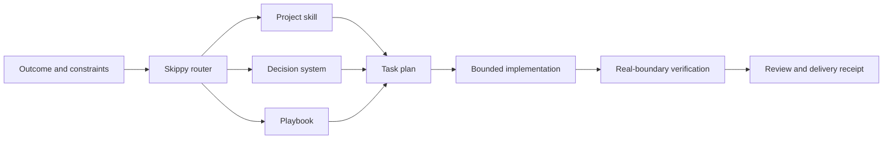
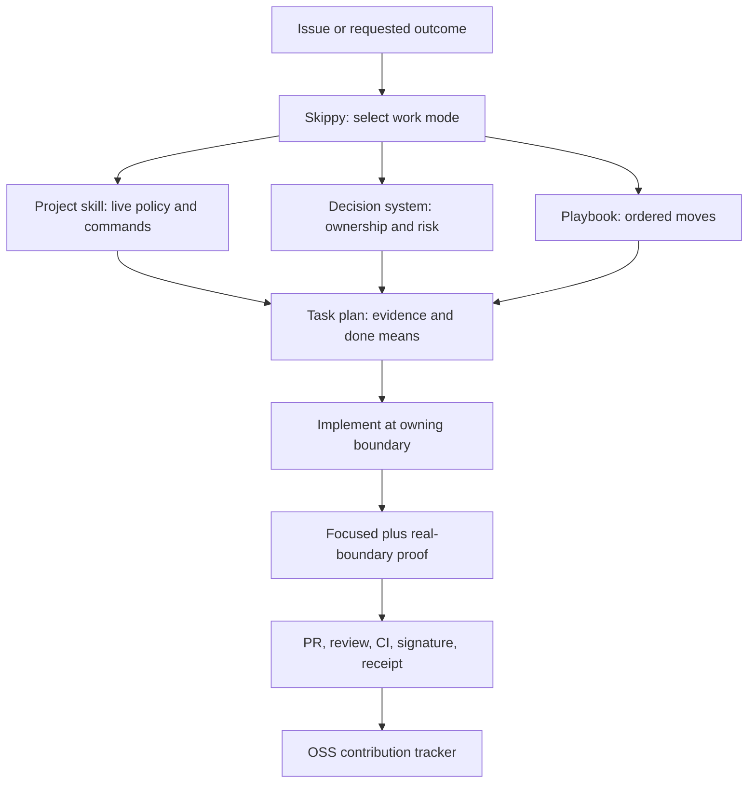
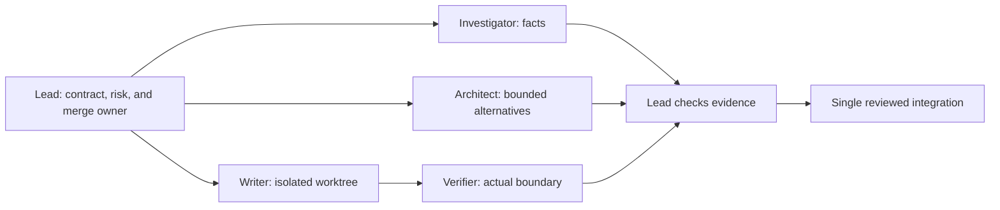

# Skippy

## Rigorous engineering for coding agents

You describe the outcome. Skippy chooses a playbook, creates a task list, loads
the right project skill, coordinates bounded specialist work when it helps, and
demands evidence before it reports success.

Skippy is an engineering system for the gap between code generation and work
another engineer can trust. It is bigger than a collection of prompts and
bigger than a collection of skills: it combines decision rules, playbooks,
project adapters, task artifacts, role boundaries, helper programs, and a
verification gate.



Its standard is simple: write less code, own the right boundary, and prove the
behavior that changed.

## Start with one command

```text
skippy <the outcome you want>
Done means <what can be observed, run, or inspected>.
Keep <behavior or boundary that must not change>.
```

Example:

```text
skippy The OAuth callback occasionally creates duplicate sessions.
Reproduce both deliveries, trace the owning race, fix it, and prove one session
is created. Keep valid login and logout behavior unchanged.
```

Skippy routes this to the Bug fix playbook, makes reproduction, root-cause
analysis, regression coverage, and real-boundary verification visible tasks,
then loads the target repository's conventions before it edits.

## What makes it an engineering system

| Layer | Purpose |
| --- | --- |
| [Skippy Mode](skippy/SKILL.md) | Routes the request, keeps the plan visible, selects supporting capabilities, and enforces the completion gate |
| [Engineering decision system](references/engineering-principles.md) | Guides ownership, complexity, reliability, security, evidence, and delivery decisions without reducing engineering to a count of slogans |
| [Playbook library](playbooks/index.md) | Supplies the ordered work moves for investigation, change, assurance, autonomous work, and contribution queues |
| [Project skills](#project-skills) | Supply each repository's live contribution policy, commands, layout, CI, review, and maintainer conventions |
| [Parallel-work protocol](references/delegation.md) | Defines accountable integration, isolated writers, independent review, and evidence handoffs |
| [Task artifacts and helpers](#durable-work) | Make decisions, completion criteria, and verification replayable across agents and sessions |
| [Contribution tracker](https://github.com/deepujain/oss-contribs) | Shows the cross-project queue without replacing the source repository's authoritative PR state |

The system is intentionally layered. A project skill does not have to recreate
general engineering judgment, and Skippy does not claim to know local facts it
has not read from the project.

The decision system is grounded in a short, explicit
[engineering foundations reading map](references/engineering-foundations.md),
then translated into work moves rather than copied as book summaries.

## Repository map

```text
skippy/
├── skippy/       Router and specialist role definitions
├── references/   Shared contribution protocol, principles, and evidence rules
├── playbooks/    Work sequences selected by uncertainty and risk
├── projects/     One project-specific contribution skill per OSS project
├── scripts/      Task-plan, decision-log, and structural-validation helpers
├── automations/  Optional continuation prompts for supported clients
└── README.md      Start here
```

The top-level folders are intentional: shared engineering guidance is separate
from project adapters, and reusable playbooks are separate from both.

## The five engineering areas and 32 principles

These are the decision areas every non-trivial task can draw from. Skippy names
only the principles that change a real choice in the task plan. There are **32
actionable principles** across the five areas below. The five areas organize the
principles; they do not replace them.

| Area | Principles used when needed |
| --- | --- |
| **Frame the problem** | explicit contracts; evidence ladder; caller and user context; facts versus inference; uncertainty; observable finish lines |
| **Design the right change** | owning boundary; singular authority; complexity reduction; understandable interfaces; compatibility; idempotence; failure design; reversible units |
| **Build for operation** | lifecycle ownership; testable security properties; real integration contracts; built-in quality; useful observability; performance budgets |
| **Verify and learn** | reproduction; changed-boundary proof; valid and rejection paths; diff review; replayable receipts; durable lessons |
| **Collaborate without losing ownership** | one integrator; stable partitions; isolated writers; bounded cognitive load; skeptical independence; complete delivery state |

Read the complete, actionable wording in the
[engineering decision system](references/engineering-principles.md).

## How an OSS contribution comes together

One goal of Skippy is making careful OSS contribution repeatable across very
different projects. It does this by joining shared engineering practice to
project-specific skills, not by applying a generic prompt to every repository.



In practice:

1. Skippy turns the request into a checkable finish condition, constraints, and
   a playbook.
2. The project skill supplies current repo facts: contribution policy, issue
   overlap checks, file layout, test commands, signing rules, PR template, and
   live CI or review expectations.
3. The decision system changes the actual engineering choices: where to fix the
   behavior, what must remain compatible, which boundary needs realistic proof,
   and how to make failure and security properties explicit.
4. The playbook makes the work sequence visible. It prevents an agent from
   dropping reproduction, overlap screening, validation, or review just because
   a patch looks plausible.
5. The contribution is delivered with an evidence receipt. The source PR is
   authoritative; the cross-project tracker records portfolio and queue state.

Read the full [OSS contribution system](references/oss-contribution-system.md).

## Start multiple agents without making a mess

Skippy can use several agents, but only where parallel work is genuinely
independent. It does not treat “more agents” as a quality guarantee.



Before fan-out, the lead gives every delegate one bounded question or write
scope, an isolated worktree or output path, expected deliverable, and stop
condition. Investigators and reviewers return evidence. Only the integrator
owns the final diff and delivery claim. This creates enough verification for
parallel work to improve confidence without turning the repository into a
shared mutable scratchpad.

When client support allows model selection, use the strongest available
reasoning model for cross-cutting design and skeptical review, and a precise
implementation model for a scoped edit. The proof still comes from the contract,
tests, real-boundary execution, and final review, not from a model label.

## Durable work

Use the helper programs when a task spans multiple turns, agents, or days.

```bash
./scripts/new-task-plan.sh oauth-session-race 'Stop duplicate OAuth sessions' 'bug fix'
./scripts/check-task-plan.sh .skippy/tasks/oauth-session-race.md
./scripts/decision-log.sh .skippy/decisions/oauth-session-race.tsv reproduce \
  'Two callback deliveries create two records' reproduced
./scripts/verify-skill-layout.sh
```

The task plan holds the outcome, constraints, completion condition, selected
playbook moves, and evidence. The decision log makes autonomous work reviewable
instead of mysterious.

## Project skills

### Bootstrap a new project

Give Skippy a canonical repository URL:

```text
skippy bootstrap https://github.com/owner/repository
```

It applies the [Bootstrap Project playbook](playbooks/bootstrap-project.md):
map architecture and ownership, design and coding guidance, language and
toolchain choices, contribution policy, current repository shape, merged-PR
patterns, closed-unmerged PR lessons, and current overlap. It then produces a
project adapter with a source-linked bootstrap report.

The scaffold helper creates the expected place for that work:

```bash
./scripts/bootstrap-project.sh repository https://github.com/owner/repository
```

It deliberately creates a **provisional** profile. The agent must complete the
analysis before claiming contribution readiness, and the first real contribution
must still verify the actual local commands and live reviewer workflow.

This works for an upstream OSS repository or your own repository. A project
skill captures local policy and recurring precedent; Skippy's principles and
playbooks remain shared across every project.

### Continuous learning across every project

Bootstrap creates the initial map. Skippy then keeps it current. After PR
reviews, CI failures, merges, closures, policy changes, or a periodic project
sweep, run:

```text
skippy learn <project>
```

The [Continuous Learning playbook](playbooks/continuous-learning.md) compares
your own and peer open, merged, and closed-unmerged PRs with live project
policy. It adopts only authoritative, recurring, or verified-repair lessons,
records their source and next action, and updates the narrowest correct layer.
That makes every contribution feed the next one without turning the project
skill into an unverified scrapbook.

### Maintain a healthy contribution queue

Each project can configure its own target number of healthy open PRs or patches
and its verified repository or contributor maximum. A healthy contribution is
open and has no unresolved contributor-actionable defect. A local branch,
candidate issue, or status table does not fill a slot.

```bash
./scripts/configure-project-queue.sh nemoclaw 5 10
```

Then run:

```text
skippy sweep and replenish nemoclaw to 5 open PRs
```

The [Contribution Queue playbook](playbooks/contribution-queue.md) first
maintains every existing contribution, runs the learning scan, verifies the
live limit, then fills eligible missing slots through the complete project
recipe. It will not create overlapping or unvalidated PRs merely to hit a
number.

For a scheduler-capable coding agent, use the reusable
[sweep-and-replenish prompt](automations/continuation/sweep-and-replenish-prompt.md)
with the project path, local checkout, target, and verified maximum filled in.
The scheduler repeats the same quality gates and does not expand publication
authority on its own.

| Project | Skill |
| --- | --- |
| NVIDIA AIQ | [projects/aiq/SKILL.md](projects/aiq/SKILL.md) |
| Apache Airflow | [projects/apache/airflow/SKILL.md](projects/apache/airflow/SKILL.md) |
| Apache Hadoop | [projects/apache/hadoop/SKILL.md](projects/apache/hadoop/SKILL.md) |
| Apache Spark | [projects/apache/spark/SKILL.md](projects/apache/spark/SKILL.md) |
| ClawHub | [projects/clawhub/SKILL.md](projects/clawhub/SKILL.md) |
| Hermes Agent | [projects/hermes-agent/SKILL.md](projects/hermes-agent/SKILL.md) |
| Inspect AI | [projects/inspect-ai/SKILL.md](projects/inspect-ai/SKILL.md) |
| Inspect Petri | [projects/inspect-petri/SKILL.md](projects/inspect-petri/SKILL.md) |
| NemoClaw | [projects/nemoclaw/SKILL.md](projects/nemoclaw/SKILL.md) |
| OpenClaw | [projects/openclaw/SKILL.md](projects/openclaw/SKILL.md) |
| PyTorch | [projects/pytorch/SKILL.md](projects/pytorch/SKILL.md) |
| Slurm | [projects/slurm/SKILL.md](projects/slurm/SKILL.md) |
| OSS contribution README | [projects/oss-contribution-readme/SKILL.md](projects/oss-contribution-readme/SKILL.md) |

## Works across coding agents

Skippy uses portable `SKILL.md` files and Markdown artifacts. It can guide
Codex, Claude Code, Cursor, Gemini CLI, Aider, Continue, OpenCode, Cline, and
other agents that load local instructions.

Clients differ in their scheduler, worktree, browser, and delegation support.
Skippy uses those capabilities when present and falls back to a portable core:
explicit contracts, bounded work, durable artifacts, and evidence.

## What Skippy does not promise

Skippy cannot make a model correct by declaration. It cannot bypass repository
permissions, replace maintainer review, or turn missing test infrastructure
into a green result. It exposes those limits and creates the smallest durable
verification capability when the project needs one.

## Install

```bash
git clone https://github.com/deepujain/skippy.git
cd skippy
./scripts/verify-skill-layout.sh
```

Attach [Skippy Mode](skippy/SKILL.md) and the target project skill. For
contribution work, also attach
[contribution quality](references/contribution-quality.md).

MIT License. See [LICENSE](LICENSE).
