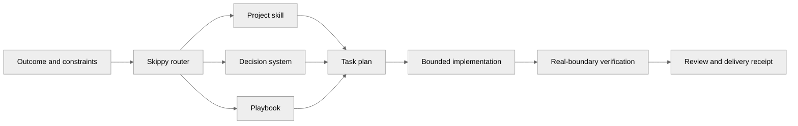
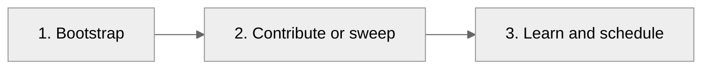
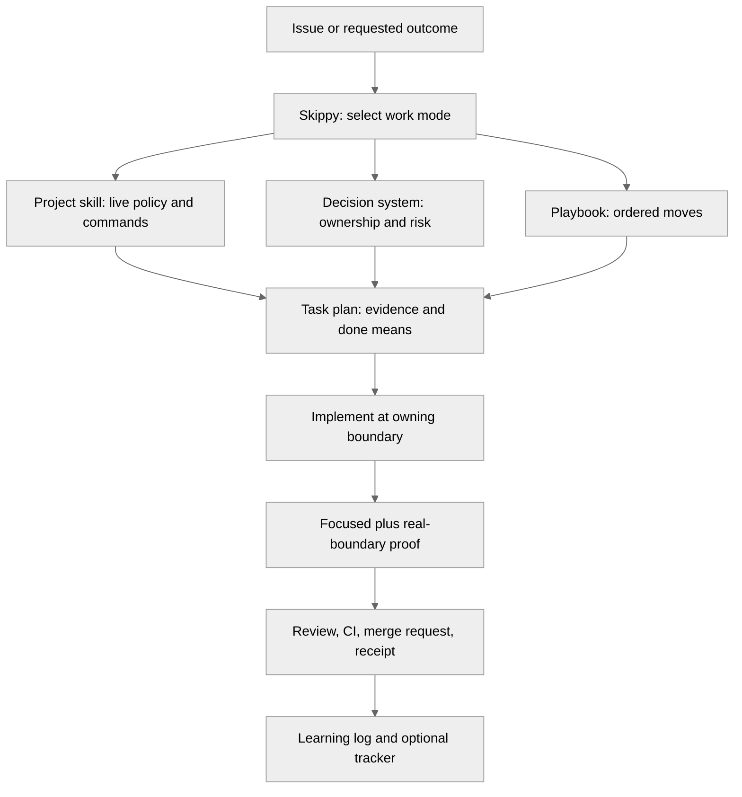
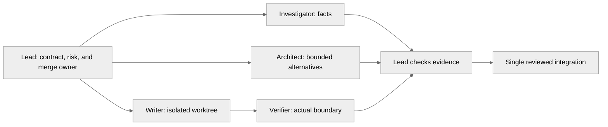

# Skippy

<p align="center">
  
</p>

Skippy is a layered engineering system for coding agents: playbooks, decision
rules, verification gates, and portable project skills. Each
`projects/<slug>/SKILL.md` captures live repository conventions, validation,
review handling, and submission practices for one upstream project.

You describe the outcome; Skippy runs the method: reproduce the problem, pick the
owning boundary, verify at a real edge, and keep open PRs merge-ready without
re-explaining the repo every session.
You get accountable delivery you can trust or hand off: visible plans, signed
commits, addressed review threads, and proof the change works, not a patch that
only looked right in chat.

It is not patching alone. Skippy covers investigation, bug fixes, features,
refactors, performance work, security hardening, PR maintenance, repository
bootstrap, and long autonomous runs on public OSS, private repos, or internal
monorepos.

## Rigorous engineering for coding agents

Coding agents generate plausible patches quickly. They are much weaker at the
engineering around them: reproducing the failure, choosing the smallest owning
boundary, knowing when a green build is not proof, learning from review, and
handing off work another engineer can trust without redoing it.

Skippy closes that gap. You describe the outcome; Skippy routes the request to
a playbook, loads the project skill for that repository, builds a visible task
plan, coordinates bounded specialist work when it helps, and refuses to report
success until the changed behavior is verified at a real boundary.

It is not a prompt pack or a skill library on its own. It is a layered
engineering system of decision rules, playbooks, project adapters, task artifacts,
role boundaries, helper programs, and a verification gate that turns agent work
into accountable delivery.



The standard is simple: write less code, own the right boundary, and prove what
changed.

Skippy follows how a strong engineer joins a codebase: read docs and history,
understand open and closed merge requests, contribute, learn from outcomes, and
keep improving. That learning is evidence-backed: bootstrap a new repository
from its sources, ship real changes, then run a calibrated
[continuous learning](references/continuous-learning.md) loop instead of
rewriting instructions from noise.

The method is in production across major open-source projects (tables below).
The same mechanism applies to private repos and internal monorepos; public OSS
is where the review history is easiest to bootstrap against.

## Skippy-Assisted Contributions

These contributions were assisted by Skippy.

| Project | Contributions | Open | Merged | Merged % |
|--------------|---------------|------|--------|----------|
| <a href="https://github.com/apache/airflow"></a> <a href="https://github.com/apache/airflow">Apache Airflow</a> | [31](https://github.com/apache/airflow/pulls/deepujain) | 5 | 9 | 29.0% |
| <a href="https://github.com/apache/hadoop"></a> <a href="https://github.com/apache/hadoop">Apache Hadoop</a> | [15](https://github.com/apache/hadoop/pulls/deepujain) | 8 | 4 | 26.7% |
| <a href="https://github.com/apache/spark"></a> <a href="https://github.com/apache/spark">Apache Spark</a> | [4](https://github.com/apache/spark/pulls/deepujain) | 2 | 0 | 0.0% |
| <a href="https://github.com/apache/superset"></a> <a href="https://github.com/apache/superset">Apache Superset</a> | [2](https://github.com/apache/superset/pulls/deepujain) | 2 | 0 | 0.0% |
| <a href="https://github.com/openclaw/clawhub"></a> <a href="https://github.com/openclaw/clawhub">ClawHub</a> | [21](https://github.com/openclaw/clawhub/pulls/deepujain) | 0 | 9 | 42.9% |
| <a href="https://github.com/NousResearch/hermes-agent"></a> <a href="https://github.com/NousResearch/hermes-agent">Hermes Agent</a> | [11](https://github.com/NousResearch/hermes-agent/pulls/deepujain) | 9 | 0 | 0.0% |
| <a href="https://github.com/UKGovernmentBEIS/inspect_ai"></a> <a href="https://github.com/UKGovernmentBEIS/inspect_ai">Inspect AI</a> | [32](https://github.com/UKGovernmentBEIS/inspect_ai/pulls/deepujain) | 4 | 14 | 43.8% |
| <a href="https://github.com/meridianlabs-ai/inspect_petri"></a> <a href="https://github.com/meridianlabs-ai/inspect_petri">Inspect Petri</a> | [3](https://github.com/meridianlabs-ai/inspect_petri/pulls/deepujain) | 0 | 1 | 33.3% |
| <a href="https://github.com/NVIDIA/Megatron-LM"></a> <a href="https://github.com/NVIDIA/Megatron-LM">Megatron-LM</a> | [5](https://github.com/NVIDIA/Megatron-LM/pulls/deepujain) | 5 | 0 | 0.0% |
| <a href="https://github.com/openclaw/openclaw"></a> <a href="https://github.com/openclaw/openclaw">OpenClaw</a> | [30](https://github.com/openclaw/openclaw/pulls/deepujain) | 1 | 4 | 13.3% |
| <a href="https://github.com/NVIDIA/OpenShell"></a> <a href="https://github.com/NVIDIA/OpenShell">OpenShell</a> | [1](https://github.com/NVIDIA/OpenShell/pulls/deepujain) | 0 | 0 | 0.0% |
| <a href="https://github.com/pytorch/pytorch"></a> <a href="https://github.com/pytorch/pytorch">PyTorch</a> | [23](https://github.com/pytorch/pytorch/pulls/deepujain) | 12 | 0 | 0.0% |
| <a href="https://github.com/NVIDIA/SkillSpector"></a> <a href="https://github.com/NVIDIA/SkillSpector">SkillSpector</a> | [9](https://github.com/NVIDIA/SkillSpector/pulls/deepujain) | 5 | 4 | 44.4% |
| <a href="https://www.schedmd.com/"></a> <a href="https://www.schedmd.com/">Slurm</a> | [3](https://support.schedmd.com/buglist.cgi?email3=deepujain%40gmail.com&emaillongdesc3=1&emailtype3=substring&list_id=418332&product=Slurm&query_format=advanced&resolution=---) | 3 | 0 | 0.0% |
| <a href="https://github.com/meridianlabs-ai/ts-mono"></a> <a href="https://github.com/meridianlabs-ai/ts-mono">ts-mono</a> | [8](https://github.com/meridianlabs-ai/ts-mono/pulls/deepujain) | 2 | 6 | 75.0% |
| **Total Contributions** | **198** | **58** | **51** | **25.8%** |

**Total Contributions:** 198 · **Success Rate:** 25.8% merged (51 of 198)

## Non-Skippy Contributions

These contributions were not assisted by Skippy.

| Project | Contributions | Open | Merged | Merged % |
|--------------|---------------|------|--------|----------|
| <a href="https://github.com/apache/avro"></a> <a href="https://github.com/apache/avro">Apache Avro</a> | [1](https://issues.apache.org/jira/browse/AVRO-1419) | 1 | 0 | 0.0% |
| <a href="https://github.com/apache/druid"></a> <a href="https://github.com/apache/druid">Apache Druid</a> | [1](https://github.com/apache/druid/pulls/deepujain) | 0 | 1 | 100.0% |
| <a href="https://github.com/eBay/nvidiagpubeat"></a> <a href="https://github.com/eBay/nvidiagpubeat">nvidiagpubeat</a> | Creator and maintainer | N/A | N/A | N/A |
| <a href="https://github.com/apache/pig"></a> <a href="https://github.com/apache/pig">Apache Pig</a> | [2](https://issues.apache.org/jira/issues/?jql=key%20in%20(PIG-1885%2C%20PIG-671)) | 0 | 2 | 100.0% |
| <a href="https://github.com/apache/zeppelin"></a> <a href="https://github.com/apache/zeppelin">Apache Zeppelin</a> | [6](https://github.com/apache/zeppelin/pulls/deepujain) | 0 | 0 | 0.0% |
| <a href="https://github.com/NICTA/scoobi"></a> <a href="https://github.com/NICTA/scoobi">Scoobi</a> | [2](https://github.com/NICTA/scoobi/pulls/deepujain) | 0 | 0 | 0.0% |
| **Total Contributions** | **12** | **1** | **3** | **25.0%** |

Refresh counts with [projects/oss-contribution-readme/SKILL.md](projects/oss-contribution-readme/SKILL.md).

## Two ways to start

Skippy applies to **any non-trivial engineering work** on any repository you can
read (public Git, private Git, internal monorepos). The playbooks cover
investigation, bug fixes, features, refactors, performance, security, and long
autonomous runs, not only external contribution.

| Entry | When to use it |
| --- | --- |
| **[Focused task](#use-skippy-for-a-focused-task)** | You know the outcome: fix a bug, add behavior, investigate a system. |
| **[Onboard to a repository](#onboard-to-a-repository)** | Skippy does not know this codebase yet, or you want to maintain a queue of in-flight changes and keep learning. |

The [project skills](#project-skills) table lists repositories that already have
adapters. Many are public OSS projects because their code and review history are
easy to bootstrap against; your own repositories use the same mechanism.

## Use Skippy for a focused task

When you already know the issue, task, or outcome, give Skippy the concrete
request and preserved behavior:

```text
skippy The OAuth callback occasionally creates duplicate sessions.
Reproduce both deliveries, trace the owning race, fix it, and prove one session
is created. Keep valid login and logout behavior unchanged.
```

Skippy matches the request to a playbook, loads the project skill when one
exists, builds a task plan, and holds the work to the completion gate.

## Onboard to a repository

Use this path when a new engineer would: clone, read, learn from merge-request
history, contribute, and maintain ongoing work.



### 1. Bootstrap

Point Skippy at a canonical repository URL it does not yet know:

```text
skippy bootstrap https://github.com/owner/repository
```

Bootstrap builds a project profile through **scaffold plus evidence**: the
agent reads architecture, design and coding rules, tools, policy, CI, and
representative open, merged, and closed merge requests, then writes a project
skill backed by sources. It does not modify the upstream repository. The first
real task still verifies commands and environment limits.

For example:

```text
skippy bootstrap https://github.com/meridianlabs-ai/ts-mono
```

For an already-supported project, skip this step. See the
[bootstrap playbook](playbooks/bootstrap-project.md) for the detailed output.

### 2. Sweep and replenish

When you want to maintain in-flight changes and fill open slots, use this packaging of
the contribution-queue playbook:

```text
skippy sweep and replenish
```

Skippy maintains existing pull requests or merge requests, runs a bounded
learning scan, and picks screened, non-overlapping follow-on work when policy
allows. It uses the configured queue target, or **5** healthy open changes when
no target is recorded, unless repository policy sets a lower maximum.

### 3. Schedule it

Ask your coding agent to schedule it:

```text
Schedule a recurring task that runs:

skippy sweep and replenish
```

If you do not state an interval, Skippy schedules it every **30 minutes**. To
choose another cadence, say so explicitly:

```text
Schedule a recurring task every hour that runs:

skippy sweep and replenish
```

On an agent without native recurring tasks, run `skippy sweep and replenish`
manually. The optional
[sweep-and-replenish prompt](automations/continuation/sweep-and-replenish-prompt.md)
and [continuation pack](automations/continuation/README.md) explain the full
task contract when you need to inspect or customize it.

The scheduler continues the same maintenance and replenishment method. It does
not bypass project limits, quality gates, or the authority required to publish a
change.

## Getting started (agent setup)

Skippy is a set of agent instructions, not a shell command. Add or attach
[Skippy Mode](skippy/SKILL.md) to your coding agent, then attach the relevant
project skill under `projects/`. The prompts above are messages you send to the
agent, not commands to paste into Terminal unless a helper script is named
explicitly.

## What makes it an engineering system

| Layer | Purpose |
| --- | --- |
| [Skippy Mode](skippy/SKILL.md) | Routes the request, keeps the plan visible, selects supporting capabilities, and enforces the completion gate |
| [Engineering decision system](references/engineering-principles.md) | Guides ownership, complexity, reliability, security, evidence, and delivery decisions without reducing engineering to a count of slogans |
| [Playbook library](playbooks/index.md) | Supplies the ordered work moves for investigation, change, assurance, autonomous work, and contribution queues |
| [Project skills](#project-skills) | Supply each repository's policy, commands, layout, CI, review, and local conventions |
| [Parallel-work protocol](references/delegation.md) | Defines accountable integration, isolated writers, independent review, and evidence handoffs |
| [Task artifacts and helpers](#durable-work) | Make decisions, completion criteria, and verification replayable across agents and sessions |
| [Contribution tracker](#skippy-assisted-contributions) | Verified cross-project PR counts and merge rates |

The system is intentionally layered. A project skill does not have to recreate
general engineering judgment, and Skippy does not claim to know local facts it
has not read from the project.

The decision system is grounded in a short, explicit
[engineering foundations reading map](references/engineering-foundations.md),
then translated into work moves rather than copied as book summaries.

## Repository map

```text
skippy/
├── skippy/       Router and specialist role definitions
├── references/   Shared contribution protocol, principles, and evidence rules
├── playbooks/    Work sequences selected by uncertainty and risk
├── projects/     One project-specific skill per repository
├── scripts/      Task-plan, decision-log, and structural-validation helpers
├── automations/  Optional continuation prompts for supported clients
└── README.md      Start here (includes contribution matrix)
```

The top-level folders are intentional: shared engineering guidance is separate
from project adapters, and reusable playbooks are separate from both.

## The five engineering areas and 32 principles

These are the decision areas every non-trivial task can draw from. Skippy names
only the principles that change a real choice in the task plan. There are **32
actionable principles** across the five areas below. The five areas organize the
principles; they do not replace them.

| Area | Principles used when needed |
| --- | --- |
| **Frame the problem** | [explicit contracts](references/engineering-principles.md#make-the-contract-explicit); [evidence ladder](references/engineering-principles.md#treat-evidence-as-a-ladder); [caller and user context](references/engineering-principles.md#start-from-the-user-and-caller); [facts versus inference](references/engineering-principles.md#distinguish-facts-inferences-and-decisions); [uncertainty](references/engineering-principles.md#name-uncertainty); [observable finish lines](references/engineering-principles.md#set-an-observable-finish-line) |
| **Design the right change** | [owning boundary](references/engineering-principles.md#change-the-smallest-owning-boundary); [singular authority](references/engineering-principles.md#make-authority-singular); [complexity reduction](references/engineering-principles.md#reduce-complexity-before-adding-it); [understandable interfaces](references/engineering-principles.md#prefer-deep-understandable-boundaries); [compatibility](references/engineering-principles.md#preserve-compatibility-deliberately); [idempotence](references/engineering-principles.md#make-retries-converge); [failure design](references/engineering-principles.md#design-failure-as-behavior); [reversible units](references/engineering-principles.md#use-reversible-units) |
| **Build for operation** | [lifecycle ownership](references/engineering-principles.md#treat-time-and-lifecycle-as-data); [testable security properties](references/engineering-principles.md#make-security-properties-concrete); [real integration contracts](references/engineering-principles.md#validate-real-integration-contracts); [built-in quality](references/engineering-principles.md#build-quality-into-the-path); [useful observability](references/engineering-principles.md#make-observability-useful); [performance budgets](references/engineering-principles.md#budget-performance-and-resource-behavior) |
| **Verify and learn** | [reproduction](references/engineering-principles.md#reproduce-before-theorizing); [changed-boundary proof](references/engineering-principles.md#prove-the-changed-boundary); [valid and rejection paths](references/engineering-principles.md#verify-both-acceptance-and-rejection); [diff review](references/engineering-principles.md#review-the-diff-as-a-product); [replayable receipts](references/engineering-principles.md#leave-a-replayable-receipt); [durable lessons](references/engineering-principles.md#turn-lessons-into-leverage) |
| **Collaborate without losing ownership** | [one integrator](references/engineering-principles.md#keep-one-accountable-integrator); [stable partitions](references/engineering-principles.md#partition-by-stable-boundaries); [isolated writers](references/engineering-principles.md#isolate-writers); [bounded cognitive load](references/engineering-principles.md#minimize-cognitive-load); [skeptical independence](references/engineering-principles.md#use-skeptical-independence); [complete delivery state](references/engineering-principles.md#finish-the-delivery-loop) |

Read the complete, actionable wording in the
[engineering decision system](references/engineering-principles.md).

## How work comes together

Skippy turns a requested outcome into evidence-backed delivery on any
repository. Shared engineering practice joins project-specific skills; it does
not apply one generic prompt everywhere.



In practice:

1. Skippy turns the request into a checkable finish condition, constraints, and
   a playbook.
2. The project skill supplies current repo facts: policy, overlap checks where
   relevant, file layout, test commands, signing or review rules, and live CI
   expectations.
3. The decision system changes the actual engineering choices: where to fix the
   behavior, what must remain compatible, which boundary needs realistic proof,
   and how to make failure and security properties explicit.
4. The playbook makes the work sequence visible. It prevents an agent from
   dropping reproduction, validation, or review just because a patch looks
   plausible.
5. Delivery ends with an evidence receipt. For external contribution portfolios,
   the [OSS contribution system](references/oss-contribution-system.md) and
   [contribution tracker](#skippy-assisted-contributions) record portfolio state without
   replacing the source repository's authoritative merge request.

## Learning over time

After meaningful outcomes such as your reviews, CI results, merged or closed merge
requests, and peer work on the same codebase, run the
[continuous learning](playbooks/continuous-learning.md) scan. Skippy adopts
only **durable**, source-linked rules (policy, recurring patterns, verified
repairs) into the project skill or learning log. It does not rewrite its
instructions from noise, single failures, or unexplained closures. That keeps
the system improving the way a team culture improves: calibrated, reviewable,
and tied to real evidence.

## Start multiple agents without making a mess

Skippy can use several agents, but only where parallel work is genuinely
independent. It does not treat “more agents” as a quality guarantee.



Before fan-out, the lead gives every delegate one bounded question or write
scope, an isolated worktree or output path, expected deliverable, and stop
condition. Investigators and reviewers return evidence. Only the integrator
owns the final diff and delivery claim. This creates enough verification for
parallel work to improve confidence without turning the repository into a
shared mutable scratchpad.

When client support allows model selection, use the strongest available
reasoning model for cross-cutting design and skeptical review, and a precise
implementation model for a scoped edit. The proof still comes from the contract,
tests, real-boundary execution, and final review, not from a model label.

## Durable work

Use the helper programs when a task spans multiple turns, agents, or days.

```bash
./scripts/new-task-plan.sh oauth-session-race 'Stop duplicate OAuth sessions' 'bug fix'
./scripts/check-task-plan.sh .skippy/tasks/oauth-session-race.md
./scripts/decision-log.sh .skippy/decisions/oauth-session-race.tsv reproduce \
  'Two callback deliveries create two records' reproduced
./scripts/verify-skill-layout.sh
```

The task plan holds the outcome, constraints, completion condition, selected
playbook moves, and evidence. The decision log makes autonomous work reviewable
instead of mysterious.

## Project skills

These are existing project adapters containing repository-specific facts Skippy has
already bootstrapped or scaffolded. New repositories begin with bootstrap in
[Onboard to a repository](#onboard-to-a-repository). Public OSS entries below
are examples with visible history; private and internal repositories use the
same layout under `projects/<slug>/`.

| Project | Skill |
| --- | --- |
| <a href="https://github.com/NVIDIA-AI-Blueprints/aiq"></a> <a href="https://github.com/NVIDIA-AI-Blueprints/aiq">NVIDIA AIQ</a> | [projects/aiq/SKILL.md](projects/aiq/SKILL.md) |
| <a href="https://github.com/apache/airflow"></a> <a href="https://github.com/apache/airflow">Apache Airflow</a> | [projects/apache/airflow/SKILL.md](projects/apache/airflow/SKILL.md) |
| <a href="https://github.com/apache/hadoop"></a> <a href="https://github.com/apache/hadoop">Apache Hadoop</a> | [projects/apache/hadoop/SKILL.md](projects/apache/hadoop/SKILL.md) |
| <a href="https://github.com/apache/spark"></a> <a href="https://github.com/apache/spark">Apache Spark</a> | [projects/apache/spark/SKILL.md](projects/apache/spark/SKILL.md) |
| <a href="https://github.com/apache/superset"></a> <a href="https://github.com/apache/superset">Apache Superset</a> | [projects/apache/superset/SKILL.md](projects/apache/superset/SKILL.md) |
| <a href="https://github.com/openclaw/clawhub"></a> <a href="https://github.com/openclaw/clawhub">ClawHub</a> | [projects/clawhub/SKILL.md](projects/clawhub/SKILL.md) |
| <a href="https://github.com/NousResearch/hermes-agent"></a> <a href="https://github.com/NousResearch/hermes-agent">Hermes Agent</a> | [projects/hermes-agent/SKILL.md](projects/hermes-agent/SKILL.md) |
| <a href="https://github.com/UKGovernmentBEIS/inspect_ai"></a> <a href="https://github.com/UKGovernmentBEIS/inspect_ai">Inspect AI</a> | [projects/inspect-ai/SKILL.md](projects/inspect-ai/SKILL.md) |
| <a href="https://github.com/meridianlabs-ai/inspect_petri"></a> <a href="https://github.com/meridianlabs-ai/inspect_petri">Inspect Petri</a> | [projects/inspect-petri/SKILL.md](projects/inspect-petri/SKILL.md) |
| <a href="https://github.com/openclaw/openclaw"></a> <a href="https://github.com/openclaw/openclaw">OpenClaw</a> | [projects/openclaw/SKILL.md](projects/openclaw/SKILL.md) |
| <a href="https://github.com/pytorch/pytorch"></a> <a href="https://github.com/pytorch/pytorch">PyTorch</a> | [projects/pytorch/SKILL.md](projects/pytorch/SKILL.md) |
| <a href="https://www.schedmd.com/"></a> <a href="https://www.schedmd.com/">Slurm</a> | [projects/slurm/SKILL.md](projects/slurm/SKILL.md) |
| Contribution matrix | [README § Contributions](#skippy-assisted-contributions) · [projects/oss-contribution-readme/SKILL.md](projects/oss-contribution-readme/SKILL.md) |

## Works across coding agents

Skippy uses portable `SKILL.md` files and Markdown artifacts. It can guide
Codex, Claude Code, Cursor, Gemini CLI, Aider, Continue, OpenCode, Cline, and
other agents that load local instructions.

Clients differ in their scheduler, worktree, browser, and delegation support.
Skippy uses those capabilities when present and falls back to a portable core:
explicit contracts, bounded work, durable artifacts, and evidence.

## What Skippy does not promise

Skippy cannot make a model correct by declaration. It cannot bypass repository
permissions, replace maintainer or reviewer judgment, or turn missing test
infrastructure into a green result. Bootstrap and learning stay evidence-backed
and refreshable. It exposes those limits and creates the smallest durable
verification capability when the project needs one.

## Install

```bash
git clone https://github.com/deepujain/skippy.git
cd skippy
./scripts/verify-skill-layout.sh
```

Attach [Skippy Mode](skippy/SKILL.md) and the target project skill when one
exists. For merge-request queue work on external repositories, also attach
[contribution quality](references/contribution-quality.md).

MIT License. See [LICENSE](LICENSE).
