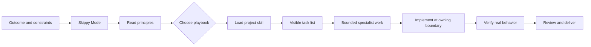
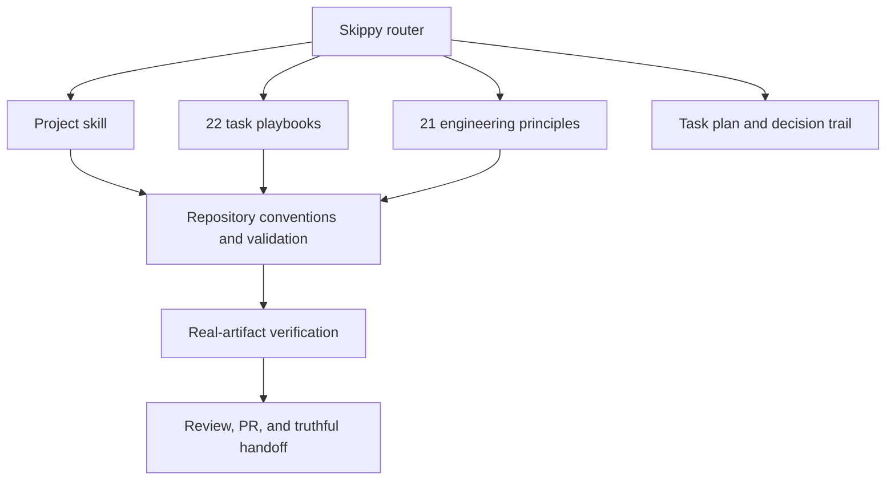
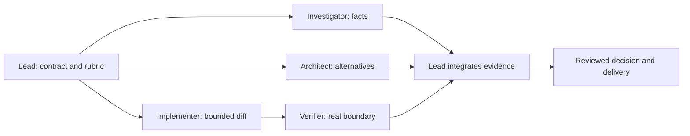

# Skippy

## Rigorous engineering for coding agents

You describe the outcome. Skippy chooses a playbook, creates a task list, loads
the right project skills, coordinates bounded specialist work when it helps, and
demands evidence before it reports success.

Skippy is a portable operating system for the gap between code generation and
engineering. It is for work where a plausible diff is not enough: a production
bug, difficult integration, high-stakes review, contribution queue, or
multi-phase change another engineer must be able to trust.

Its standard is simple. Write less code. Own the right boundary. Prove the
behavior that changed.



## Start with one command

```text
skippy <the outcome you want>
Done means <what can be observed, run, or inspected>.
Keep <behavior or boundary that must not change>.
```

Example:

```text
skippy The OAuth callback occasionally creates duplicate sessions.
Reproduce both deliveries, trace the owning race, fix it, and prove one session
is created. Keep valid login and logout behavior unchanged.
```

Skippy matches that request to the Bug fix playbook. It makes reproduction,
root-cause analysis, regression coverage, and same-surface verification visible
tasks. It does not substitute a passing build for proof that duplicate sessions
are gone.

## The operating model

Skippy is an orchestration layer over project skills. It is not a generic prompt
that pretends every repository is the same.



The router applies the smallest process that earns confidence. A minor wording
correction does not need an architecture arena. A concurrency bug, security
boundary, or cross-project migration does.

## What ships today

| Capability | What it does |
| --- | --- |
| [Skippy Mode](oss/skippy/SKILL.md) | Routes non-trivial work, keeps playbook steps visible, calls supporting skills, and enforces an evidence gate |
| [21 engineering principles](oss/references/engineering-principles.md) | Changes decisions about ownership, types, concurrency, security, verification, and delivery |
| [22 playbooks](oss/playbooks/index.md) | Covers investigation, bug fixes, features, refactoring, performance, design, reviews, PR maintenance, autonomous runs, and more |
| [Project skills](#project-skills) | Repository-specific contribution recipes and current validation conventions |
| [Specialist profiles](oss/skippy/agents) | Portable investigator and verifier roles for bounded independent work |
| [Helper programs](scripts) | Create and check task plans, record decisions, and validate the collection |
| [Continuation pack](automations/continuation) | Optional host-agnostic prompts for heartbeat or scheduler-enabled clients |
| [Contribution tracker](https://github.com/deepujain/oss-contribs) | The live cross-project public portfolio and queue record |

## Principles and playbooks

Skippy begins multi-step work by reading the principles index. Principles do not
exist as decoration. The task plan names only the principles that changed a real
decision.

The 22 playbooks prevent a familiar failure mode: an agent reads a workflow and
then invents a shorter plan that quietly drops the hard parts. The selected
playbook is copied into the task list. If Skippy skips a step, it keeps the step
and records why.

| Group | Playbooks |
| --- | --- |
| Understand | Investigation, historical analysis, runtime forensics, trace forensics, session pickup |
| Build | Bug fix, feature delivery, refactoring, performance, hillclimb, prototype, architecture arena |
| Assure | Security hardening, verification skill, verification maintenance, code review, PR maintenance, release critical |
| Sustain | Autonomous run, multi-phase plan, pause safely, skill evolution |

Read [all principles](oss/references/engineering-principles.md) and [all playbooks](oss/playbooks/index.md).

## Delegation without chaos

Delegation is not a substitute for ownership. Skippy delegates only independent
work that improves confidence, and keeps writers isolated.



When a client supports multiple models, Skippy uses the strongest available
reasoning model for cross-cutting design and skeptical review, and an
appropriate code model for precisely scoped implementation. The primary agent
still reads every result, owns the integrated diff, and decides what evidence is
sufficient.

## Durable work

Use the helper programs when a task spans multiple turns, agents, or days.

```bash
./scripts/new-task-plan.sh oauth-session-race 'Stop duplicate OAuth sessions' 'bug fix'
./scripts/check-task-plan.sh .skippy/tasks/oauth-session-race.md
./scripts/decision-log.sh .skippy/decisions/oauth-session-race.tsv reproduce \
  'Two callback deliveries create two records' reproduced
./scripts/verify-skill-layout.sh
```

The task plan holds the outcome, constraints, completion condition, playbook
steps, and evidence. The decision log makes autonomous work reviewable instead
of mysterious.

## Project skills

| Project | Skill |
| --- | --- |
| NVIDIA AIQ | [oss/aiq/SKILL.md](oss/aiq/SKILL.md) |
| Apache Airflow | [oss/apache/airflow/SKILL.md](oss/apache/airflow/SKILL.md) |
| Apache Hadoop | [oss/apache/hadoop/SKILL.md](oss/apache/hadoop/SKILL.md) |
| Apache Spark | [oss/apache/spark/SKILL.md](oss/apache/spark/SKILL.md) |
| ClawHub | [oss/clawhub/SKILL.md](oss/clawhub/SKILL.md) |
| Hermes Agent | [oss/hermes-agent/SKILL.md](oss/hermes-agent/SKILL.md) |
| Inspect AI | [oss/inspect-ai/SKILL.md](oss/inspect-ai/SKILL.md) |
| Inspect Petri | [oss/inspect-petri/SKILL.md](oss/inspect-petri/SKILL.md) |
| NemoClaw | [oss/nemoclaw/SKILL.md](oss/nemoclaw/SKILL.md) |
| OpenClaw | [oss/openclaw/SKILL.md](oss/openclaw/SKILL.md) |
| PyTorch | [oss/pytorch/SKILL.md](oss/pytorch/SKILL.md) |
| Slurm | [oss/slurm/SKILL.md](oss/slurm/SKILL.md) |
| OSS contribution README | [oss/oss-contribution-readme/SKILL.md](oss/oss-contribution-readme/SKILL.md) |

## Works across coding agents

Skippy uses portable `SKILL.md` and Markdown artifacts. It works with Codex,
Claude Code, Cursor, Gemini CLI, Aider, Continue, OpenCode, Cline, and other
agents that can load local instructions.

Some clients offer scheduler heartbeats, isolated worktrees, browser control,
or per-delegate model selection. Skippy uses those capabilities when present,
but does not pretend they exist everywhere. The portable core remains the same:
explicit contracts, good routing, bounded work, and evidence.

## What Skippy does not promise

Skippy cannot make a model correct by declaration. It cannot bypass repository
permissions, replace maintainer review, or turn missing test infrastructure
into a green result. It exposes those limits and creates the smallest durable
verification capability when the project needs one.

## Install

```bash
git clone https://github.com/deepujain/skippy.git
cd skippy
./scripts/verify-skill-layout.sh
```

Attach [Skippy Mode](oss/skippy/SKILL.md) and the target project skill. For
contribution work, also attach
[contribution quality](oss/references/contribution-quality.md).

MIT License. See [LICENSE](LICENSE).
