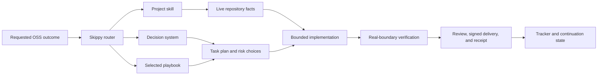

# How Skippy Produces an OSS Contribution

Skippy is the shared operating layer. A project skill is the local adapter.
Together they let the same engineering method travel across repositories
without pretending that every community, test suite, contributor policy, or
release process is the same.

## Responsibilities are deliberately separate

| Layer | Owns | Does not invent |
| --- | --- | --- |
| User outcome | Product need, scope, and constraints | Repository commands or proof claims |
| Skippy router | Work mode, playbook choice, task plan, evidence gate, and delegation boundary | Project-specific policy or stale runtime facts |
| Decision system | Reasoning quality: ownership, compatibility, failure design, security, verification, and delivery | A universal implementation recipe |
| Playbook library | Ordered work moves for the dominant uncertainty | Exact commands, branch names, or maintainer customs |
| Project skill | Current contribution rules, file layout, validation, identity, issue and PR workflow | Shared principles duplicated in every repository |
| Verifier and reviewer | Independent evidence and skeptical findings | The integrator's final ownership |
| Contribution tracker | Cross-project queue and lifecycle visibility | A replacement for the source repository's PR state |

## A contribution is assembled, not merely prompted

1. **Route the request.** Skippy turns an outcome into an observable finish
   condition, preserved behavior, risk posture, and a selected playbook.
2. **Load local facts.** The project skill supplies live upstream conventions:
   issue overlap checks, current code locations, commands, commit policy, PR
   template, and review or CI expectations.
3. **Plan the proof.** The task artifact records the decisions that matter,
   work steps, validation boundary, and skipped steps. This keeps a later
   session or reviewer from guessing why a shortcut was taken.
4. **Perform bounded work.** One integrator owns the change. Independent agents
   may investigate, compare designs, review, or verify, but writers use isolated
   worktrees and return a defined artifact or evidence receipt.
5. **Verify the product boundary.** Skippy pairs focused tests with the closest
   realistic CLI, API, storage, process, UI, or workflow check the project can
   run. A limitation stays visible rather than being converted into a green
   claim.
6. **Deliver and continue.** The final PR or patch states exact evidence,
   signatures, CI/review state, risk, and next owner. The tracker records the
   lifecycle across projects; the source PR remains authoritative.

## Parallel work that stays coherent

Several agents can work in parallel only after the lead creates stable
boundaries: an independent question, a dedicated worktree or output location,
a deliverable, and a verification rule. The lead integrates serially after
checking the evidence and final diff.

That is the difference between parallelism and a swarm of competing edits.
Skippy earns trust through partitioning, real verification, and accountable
integration. It never asks users to trust a model's confidence alone.
