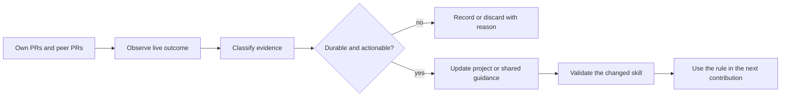

# Continuous Contribution Learning

Skippy improves from contribution outcomes, but it does not blindly rewrite its
own instructions. Learning is an evidence-backed maintenance loop that converts
repeated or authoritative signals into a small, validated rule at the correct
layer.



## What to scan

Run a learning scan at each meaningful lifecycle transition and periodically
alongside a project sweep. Inspect:

- **Your own open PRs:** new reviews, CI failures, conflicts, stale state,
  maintainer requests, and changed merge requirements.
- **Your own departed PRs:** merged, closed, superseded, or maintainer-adopted
  changes, including the evidence for the final state.
- **Peer merged PRs:** current accepted scope, code location, validation,
  review, and PR-body patterns in relevant subsystems.
- **Peer closed-unmerged PRs:** direct closure reason, duplicate or replacement
  links, reviewer objections, CI failures, and scope traps. Treat unexplained
  closure as unknown.
- **Current repository policy:** contributor docs, workflows, templates,
  security and signing rules, issue labels, and bot behavior.

Keep a scan bounded and relevant. Read the recent work that can change the next
contribution decision, plus relevant historical precedent for a disputed or
risky area. Do not create a noisy archive of every PR.

## When a lesson is durable

Adopt a lesson only when one of these is true:

1. A current authoritative policy, maintainer statement, CI rule, or repository
   file directly establishes it.
2. The same pattern appears in at least two independent, source-linked PR or
   review outcomes.
3. A concrete failure and its verified repair establish a project-specific
   rule that would have changed the original work.

Record the source URL or commit, the observation, the proposed rule, its layer,
and how it will change a next action. Preserve rejected or uncertain candidates
briefly with the reason, so the same weak inference is not repeatedly proposed.

## Where learning goes

| Lesson type | Home |
| --- | --- |
| Exact path, command, CI lane, review bot, signing rule, or maintainer convention | `projects/<slug>/SKILL.md` and its learning log |
| Architecture, ownership, toolchain, or validation pattern for one project | `projects/<slug>/references/bootstrap-report.md` or learning log |
| Reusable contribution method across projects | A shared Skippy reference or playbook |
| One PR's current status | The source PR, issue, task receipt, or contribution tracker, not a permanent skill rule |
| Private, sensitive, or unverified material | Do not add it to the public skill repository |

## Learning scan procedure

1. Start from the last scan record and identify new own and peer PR outcomes.
2. Read live sources before interpreting an old summary.
3. Classify each signal as policy, recurring pattern, verified repair, one-off,
   or unknown.
4. Turn only durable signals into a short imperative rule with a source and a
   clear future action.
5. Update the narrowest correct layer, validate the changed skill collection,
   and commit the skill improvement when persistent updates are in scope.
6. Keep the next project sweep using the new rule. If the rule proves wrong or
   becomes stale, revise or remove it with evidence.

## Learning log shape

Use `projects/<slug>/references/learning-log.md` for a project-specific ledger:

```markdown
## 2026-08-31: validation command

Source: https://example.invalid/pull/123
Classification: authoritative policy | recurring pattern | verified repair | rejected
Observation: <fact, not a conclusion>
Adopted rule: <short imperative rule, or "none">
Next action: <what a future contribution changes>
```

The log is a decision receipt, not a diary. Prefer concise source-linked entries
that change behavior.
